# 园区伙伴（全民营销 · 云仓生态）开发方案 · 团队交付版

> **读者**：后端（Java/Spring Boot 3）、前端（Vue 3/Element Plus）、小程序（uni-app）、测试、运营负责人。
> **定位**：本文是开发依据。调研过程、蜜源对比、现状摸底与决策记录见姊妹文档《[全民营销（推荐分佣）方案 · 调研与设计]（中枢 PARK-MKT-002）》，本文不重复。
> **仓库**：`zhyq-park`（DIPARK园区系统，ver6.4 分支）。挂载位置：`招商租赁 › 招商 › 全民营销`（二级目录）。
> **已拍板（2026-09-18）**：①岗位名用合伙人系；②份额分配 = 后台定默认与下限，钻石合伙人可在区间内下调自己团队；③园区不自建/不采购 ERP，云仓用自己的系统接我们的开放接口。
> **待拍板**：岗位数默认 2（可切 4）；打款方式 P1–P3 线下、P4 微信商家转账（需负责人开通商户号）；**佣金税务模式**（个税代扣 / 灵活用工平台代征，见 §2.9）。
> **v7.3（2026-09-18 负责人拍板）**：园区入驻与客户入仓是**两套独立产品、两套计佣**（§2.7a）：**园区入驻 = 市场惯例，一次性收「月租金 × 0.5 或 1 个月」作佣金池**（月租金 = 单价 × 面积），首期租金到账解冻，90 天内退租扣回；**客户入仓 = 每张出库单的园区服务费 × 评级总比例，持续**；直签 = 每期平台费 × 总比例。
> **v7 增补（2026-09-18 负责人三条新逻辑）**：①签约方式可选（园区签 / 云仓直签，§2.3a）；②伙伴锁客 180 天两段式报备（§2.2a）；③云仓端小程序 + 加盟顺序改为 ERP 打通在签协议前（§2.5、§5.6、§6.2）。
> **v6 自审完善（2026-09-18）**：见 §10「自审记录」——修正了 12 处思考不周，其中最关键的三处：①云仓订单的计佣基数从"实付货值"改为**园区服务费**（园区赚多少才分多少）；②订单归属改为按**客户在云仓 ERP 的货主编码**映射，不再靠订单上的手机号/推荐码；③服务合同的路径 A 从"首年预计服务费"改为**按评级的固定签约奖**，杜绝虚报预计量。

---

## 0. 术语表

| 术语 | 定义 | 表 |
|---|---|---|
| 客户 | 货主 / 电商卖家 / 需要仓储发货或入驻园区的企业；**与园区签合同、付钱给园区** | `crm_customer`（复用意向客户） |
| 园区伙伴（伙伴） | 通过小程序注册的中间商，推荐客户、拿佣金；有岗位、有上级 | `crm_promoter` |
| 岗位 | 园区伙伴 → 银牌合伙人 → 金牌合伙人 → 钻石合伙人（2 级模式：园区伙伴 → 合伙人）；决定份额 | `crm_position` |
| 份额 | 该岗位可拿到「总比例」的百分比，顶格 100% | `crm_position.share_pct` |
| 级差 | 上级份额 − 下级已拿份额；上级只拿级差 | 计算值，落 `crm_promoter_commission.diff_pct` |
| 客户评级 | A/B/C/D，决定总比例 | `crm_customer_grade` |
| 总比例 | 园区为一笔成交最多支付的佣金比例（按评级、按来源） | `crm_customer_grade.*_total_rate` |
| 计佣事件 | 触发算佣金的一件事：合同生效 / 云仓发货订单 | `crm_referral_order` |
| 佣金流水 | 一笔计佣事件拆给每个收款人的一行 | `crm_promoter_commission` |
| 加盟云仓（云仓） | 加盟园区、承接客户仓储/发货的第三方仓；**履约方，不是签约方** | `crm_warehouse` |
| ERP 打通 | 云仓用自己的 ERP 接园区开放接口（webhook / 拉取 / 文件），订单事件回流 | `crm_warehouse_erp` |
| 云仓服务合同 | 客户 ↔ 园区签的仓储/代发服务合同 | `crm_service_contract` |
| 云仓结算单 | 园区 → 云仓按周期结算服务费 | `crm_warehouse_settlement` |
| 提现单 | 伙伴把可提现佣金提出来（税前 / 税后） | `crm_withdrawal` |
| 签约方式 | 客户级选择：**园区签**（客户 ↔ 园区，园区付云仓）或 **云仓直签**（客户 ↔ 云仓，云仓付园区平台费）；决定钱怎么走、佣金基数是什么 | `crm_customer.sign_mode` |
| 锁定（报备） | 伙伴报备客户后的独占期：预锁 7 天 → 有效锁定 180 天；期内该客户的成交归该伙伴 | `crm_customer_lock` |
| 货主编码 | 客户在某家云仓 ERP 里的编码；云仓订单靠它归属到客户与伙伴 | `crm_customer_erp_map.customer_code` |
| 出库单 | 云仓为客户发出的一票货 = 路径 B 的一个计佣事件；基数 = 园区服务费 | `crm_referral_order` |

---

## 1. 业务全景

### 1.1 参与方与职责

| 参与方 | 端 | 做什么 |
|---|---|---|
| 客户 | 无（被服务） | 被推荐 → 与园区签合同 → 付款 → 使用云仓服务（下单/发货走云仓 ERP） |
| 园区伙伴 | 微信小程序 | 注册绑定上级 → 推荐客户 → 看进度 → 拿佣金 → 提现；钻石合伙人可给团队调份额 |
| 招商专员 | 后台 | 跟进客户、评级、分配云仓、起草合同、推进签署 |
| 运营 | 后台 | 审核伙伴、审核云仓加盟、推进 ERP 打通、处理断连、佣金结算、提现审核 |
| 财务 | 后台 | 打款（伙伴提现、云仓结算）、对账 |
| 管理员 | 后台 | 岗位数切换、份额与总比例、规则参数、权限 |
| 加盟云仓 | P1–P3 由运营代操作；P4 云仓自助门户 | 提交加盟、签协议、打通 ERP、承接客户、发货、确认结算单 |

### 1.2 业务链路（主链）

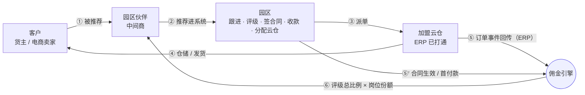

### 1.3 资金流（三条钱，分开记账）

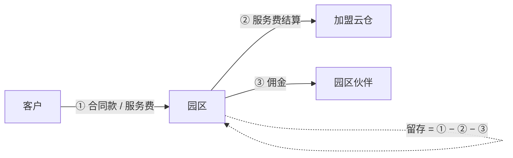

| # | 钱 | 从 → 到 | 依据 | 落表 |
|---|---|---|---|---|
| ① | 合同款 / 服务费 | 客户 → 园区 | 云仓服务合同 / 租赁合同 | 现有 `fin_bill` / `fin_payment`（应收） |
| ② | 服务费结算 | 园区 → 云仓 | 按周期按发货量 × 云仓费率表 | `crm_warehouse_settlement`（direction=付） |
| ③ | 佣金 | 园区 → 伙伴 | 评级总比例 × 岗位份额（级差） | `crm_promoter_commission` → `crm_withdrawal` |

**签约方式二：云仓直签（v7）**——客户与云仓签合同、付钱给云仓；云仓按周期付园区**平台费**（按单或按比例，云仓加盟协议约定）；园区再付伙伴佣金。


| 对比 | 园区签 | 云仓直签 |
|---|---|---|
| 合同双方 | 客户 ↔ 园区 | 客户 ↔ 云仓（园区备案审核） |
| 园区收入 | 客户服务费 − 付云仓 | 云仓付的平台费 |
| **佣金基数** | 园区服务费（合同单价表 × 件数） | **平台费**（云仓应付园区的那部分，按单算） |
| 解冻条件 | 客户首期款到园区 | **云仓平台费结算款到园区** |
| 云仓结算单方向 | 园区 → 云仓（应付） | 云仓 → 园区（应收） |
| 合同录入 | 专员在后台 | 云仓在云仓小程序上传 → 园区审核备案 |
| 适用 | 园区想控客户关系与现金流 | 云仓强、客户要直接对仓；园区轻资产 |

`sign_mode` 是**客户级**默认（后台「客户管理 › 签约方式」设定，可按园区设默认值），每份合同落快照；同一客户不同合同可不同。

规则：**园区只在收到钱后才付钱** —— 租赁的一次性佣金要等首期租金到账才解冻；入仓的出库单佣金要等发货后冻结期满无退款；直签平台费到账即可结算（§2.7a）。**园区毛利 = ① − ② − ③ 必须 ≥ 0**：分配云仓时系统按合同单价表与云仓费率表试算毛利，为负则阻止并提示。

### 1.5 前置条件（外部依赖，开发前要拿到）

| 依赖 | 用途 | 谁办 | 阻塞哪期 |
|---|---|---|---|
| 微信小程序（企业主体）AppID / AppSecret、手机号快速验证组件、订阅消息模板 | 伙伴登录、注册、通知 | 负责人（凭据不过 AI 手） | P3 |
| 微信支付商户号 + 商家转账到零钱权限 | 自动打款 | 负责人 | P4 |
| 灵活用工 / 委托代征平台（或财务确认个税代扣流程） | 伙伴佣金税务合规 | 负责人 + 财务 | P1 上线前定口径，P4 接平台 |
| 电子签服务商（e 签宝 / 法大大等） | 合同、加盟协议线上签 | 负责人 | P4（P1–P3 线下上传） |
| 短信通道（现有 `NotifyChannel.sms` 为 Mock） | 云仓断连告警、客户合同提醒 | 负责人 | P2 |
| 开放接口公网域名 + HTTPS（park.vvaix.com 已有） | 云仓 webhook 回调 | 已具备 | — |
| 伙伴协议 / 隐私协议 / 加盟协议 文本 | 注册与加盟时勾选 | 法务 / 负责人 | P1 |


### 1.4 端与系统边界

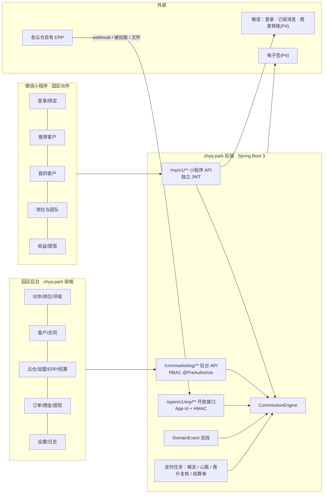

---

## 2. 核心流程（每个流程一张图 + 规则）

### 2.1 伙伴注册与绑定上级

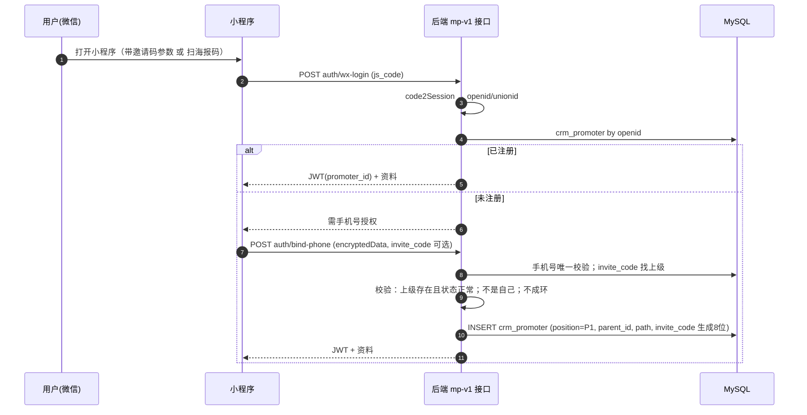

规则：
- 上级**终身绑定**；只有后台运营可改（写原因、写审计）。
- 没带邀请码的注册：`parent_id = NULL`，成为独立根节点；之后 7 天内可补填一次邀请码（规则参数可配）。
- `path` 物化路径 `/根/…/自己/`，查任意上级不递归；改上级时**整棵子树的 path 一起改**（事务）。
- 邀请码 8 位，去掉易混字符（0/O/1/I），唯一索引。

### 2.2 推荐客户与归因判定（防抢客）

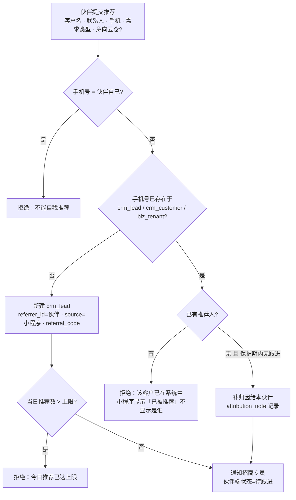

规则参数：归因规则「先到先得」或「N 天保护期」（默认先到先得）；重复客户判定字段（默认手机号；可加统一社会信用代码）；单人日推荐上限（默认 20）。

补充规则（v6）：
- **归因按业务线分开判定**：同一客户「租赁」与「云仓服务」两条线各自归因。老租客没有云仓合同、且云仓线 N 天内无跟进 → 允许伙伴为其云仓线归因（老带新场景）。
- **内部人员**：伙伴手机号命中 `sys_user.phone` → 标记「内部人员」，默认不计佣（规则参数 `internal_commission=off`），页面显示标记，防止专员自己当伙伴。
- **客户内推**：客户的员工注册为伙伴推荐自己公司 → 允许（只拒绝手机号完全相同的自我推荐）。
- 并发：同一手机号两人同时推荐 → Redis 锁 `referral:{phone}` + `crm_customer.phone` 唯一约束兜底，后到者收到「已被推荐」。

### 2.2a 伙伴锁客（报备两段式，v7）

伙伴认识很多客户但还没成交——允许**报备锁定**，期内该客户的成交归他。为防止倒一堆手机号占坑，分两段：

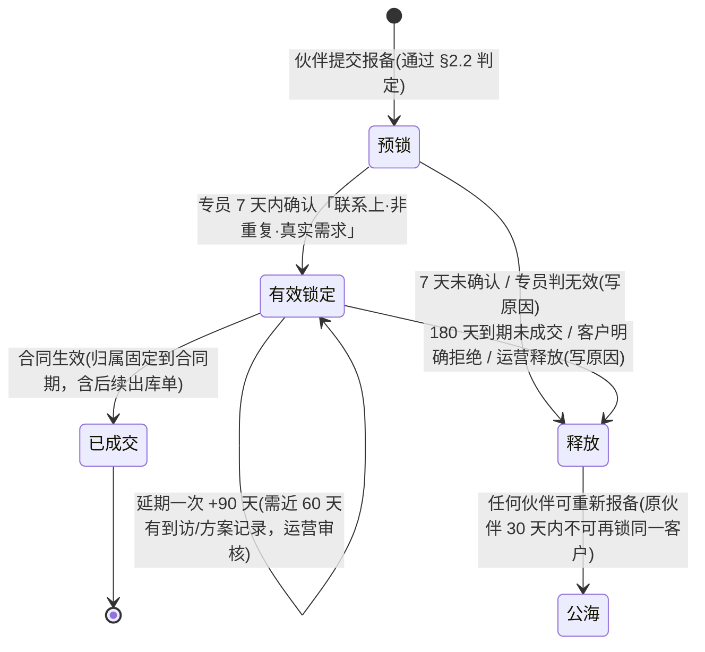

| 规则 | 默认 | 说明 |
|---|---|---|
| 预锁期 | 7 天 | 提交即生效，专员确认后转有效 |
| 有效锁定期 | 180 天 | 规则参数 `lock_days` |
| 延期 | 1 次 +90 天 | 需近 60 天有到访 / 方案记录，运营审核 |
| 锁定数上限（按岗位） | 园区伙伴 50 / 银牌 100 / 金牌 200 / 钻石 500 | `crm_position.lock_cap`；含预锁 |
| 冷却 | 释放后原伙伴 30 天内不可再锁同一客户 | 防反复占坑 |
| 成交后 | 归属固定到合同期，合同续签延续，合同终止 90 天后释放 | |
| 展示 | 小程序「我的客户」显示锁定状态与剩余天数；到期前 15 天提醒 | |
| 后台 | 客户详情「锁定」页签：延期 / 释放 / 转移（写原因·审计） | |

锁定与 §2.2 归因的关系：§2.2 决定「能不能报备」，本节决定「报备后独占多久」。

### 2.3 客户跟进 → 评级 → 分配云仓 → 签合同

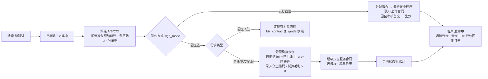

客户状态：待跟进 → 已到访 → 方案中 → 待签约 → 履约中 → 流失（任意阶段可流失，写原因）。

### 2.3a 签约方式（v7）

- 后台「客户管理」设 `sign_mode`（默认取园区级参数 `default_sign_mode`）；专员在起草合同前必须确认。
- **园区签**：走 §2.4 状态机，专员起草。
- **云仓直签**：云仓在云仓小程序「我的客户 › 上传合同」录入关键字段（起止、计费模式、单价）并上传盖章件 → 园区运营审核 → `crm_service_contract(sign_mode=2)` 状态直接进「已生效」→ 发路径 A 计佣事件（冻结）→ 云仓首期平台费结算款到账后解冻。直签合同园区不生成客户应收账单，只生成**云仓平台费应收**。
- 切换：客户已有生效合同时不允许改 `sign_mode`（新合同可另选）。

### 2.4 云仓服务合同状态机

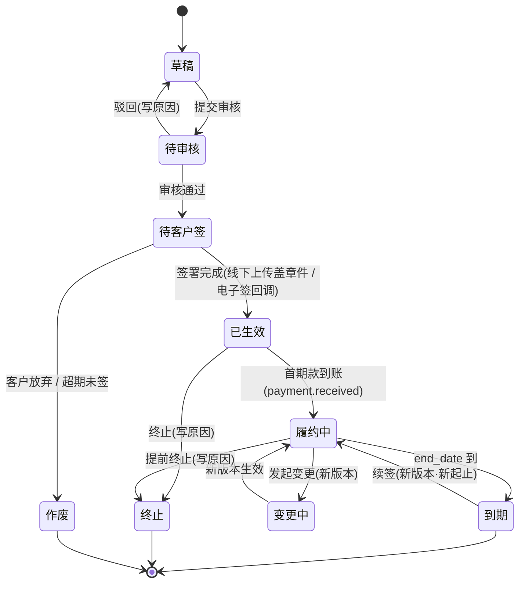

副作用（由 `ServiceContractService` 在状态迁移时发事件）：

| 迁移 | 副作用 |
|---|---|
| → 已生效 | 发 `DomainEvent.ServiceContractEffective` → 佣金引擎生成路径 A 计佣事件（**冻结**）；生成首期应收账单 `fin_bill`；通知承接云仓「新客户」 |
| → 履约中 | 发 `payment.received` → 该合同佣金 **解冻为可结算**；客户状态 = 履约中。**「首期款」定义**：保证金 / 首期账单 / 首月服务费账单任一到账即算；纯后付合同以首月账单收款为准 |
| → 终止 / 作废（生效后） | 未结算佣金作废；已结算的按规则参数决定是否扣回（默认：生效 90 天内终止扣回） |
| 到期前 30 / 7 天 | 消息模板「合同到期提醒」给专员与客户 |
| 换仓（变更） | 合同变更新版本：新增/移除承接云仓（`crm_contract_warehouse`）、写切换日期；旧仓结算到切换日、新仓从切换日起；通知两仓；订单按事件日期落到当日承接仓 |

### 2.5 云仓加盟状态机 + ERP 打通验收

**顺序（v7 拍板：先打通 ERP 再签协议）**：1 申请 → 2 资质审核 → **3 ERP 打通（沙箱凭证 · 联调 · 验收）** → 4 签加盟协议 → 5 上线。ERP 打不通的云仓走不到签协议，避免签了才发现接不上。

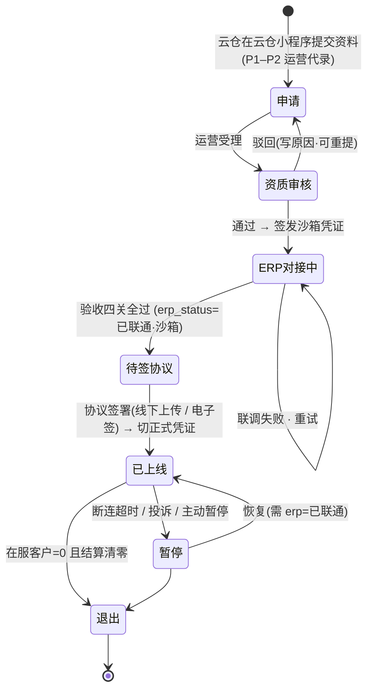

云仓端小程序（v7，与伙伴端同一个小程序、按手机号识别身份）：申请 → 看进度（5 步 + 每步负责人与时限）→ ERP 自助（拿沙箱/正式凭证、发测试单、看回执与同步日志、看心跳）→ 上线后运营看板（承接客户、今日/本月出库单、异常）→ 结算单确认 / 争议 → 直签模式下上传客户合同。

ERP 打通（第 4 步）细化：

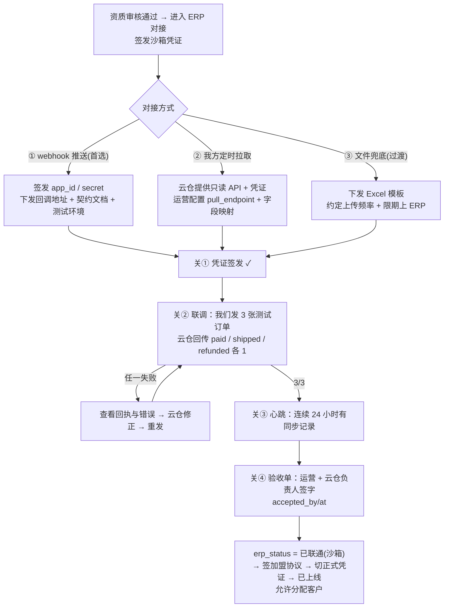

上线后监控（`ErpHeartbeatJob` 每 10 分钟）：`now − heartbeat_at > 6h` → `erp_status=断连`、告警（运营 + 云仓联系人）、**禁止新分配**；恢复同步后自动回「已联通」。文件方式：超过约定上传周期 2 倍未上传视同断连。

### 2.6 ERP 订单事件 → 计佣（路径 B）

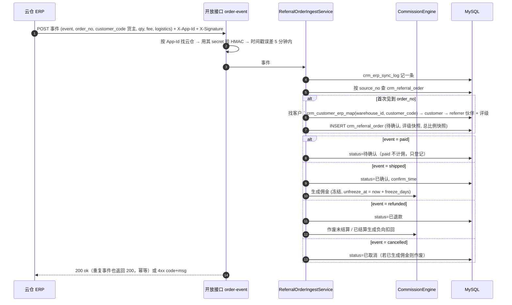

去重键 `(source_no, event)`；乱序：`refunded` 先于 `shipped` 到达 → 记录，`shipped` 到达时直接作废不生成。

**订单归属（v6 修正）**：云仓发货订单是**货主（我们的客户）的出库单**，订单上的收件人是客户的消费者、与我们无关。归属只认 `customer_code`（客户在该云仓 ERP 里的货主编码）→ `crm_customer_erp_map` → 客户 → 推荐伙伴。映射在「分配云仓」时由运营录入（云仓提供编码）。`customer_code` 未映射 → 视为**云仓自有客户订单**，记录但**不计佣、不进园区结算**，进「ERP 对账 › 无归属订单」，运营可补映射后重算。

**计佣基数（v6 修正）**：路径 B 的基数默认 = **该订单的园区服务费**（按客户合同单价表由园区自己算：单票费 + 按件费 × qty，不信任 ERP 传来的金额），可选「固定每单」或「货值」（`base_mode`）。理由：园区只按自己赚到的钱分佣。

**退货**：`order.returned`（退货入库）事件：基数为服务费时**不扣回**（服务已发生）；基数为货值时扣回；`order.refunded`（服务费退款，少见）一律扣回。

**拆单 / 合单**：一个出库单一个 `order_no`；拆单的子单带 `parent_order_no`，各自计佣；合单只推一次。

### 2.7 佣金引擎：总比例级差拆分（核心算法）

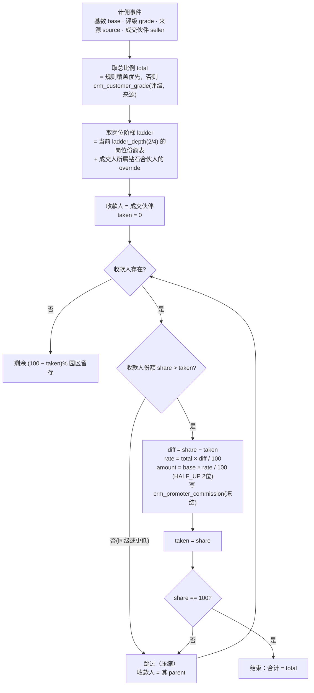

伪代码（后端 `CommissionEngine.split()`）：

```java
BigDecimal total = resolveTotalRate(order);            // 评级 × 来源，规则覆盖优先
List<PositionShare> ladder = resolveLadder(order.sellerId); // 2/4 级 + 钻石合伙人 override
Promoter p = seller; int taken = 0; List<Commission> out = new ArrayList<>();
while (p != null && taken < 100) {
    int share = ladder.shareOf(p.positionCode);
    if (share > taken) {
        int diff = share - taken;
        BigDecimal rate = total.multiply(diff).divide(100, 4, HALF_UP);
        out.add(commission(order, p, share, diff, rate, base.multiply(rate).divide(100, 2, HALF_UP), FROZEN));
        taken = share;
    }
    p = p.parent();  // 沿 path 向上；上限循环次数 = ladder.size()
}
// 断言：sum(out.rate) <= total；无重复收款人；同一 order 不重复生成（唯一键 order_id+promoter_id）
```

快照：`crm_referral_order` 存 `grade/total_rate`，`crm_promoter_commission` 存 `position_code/share_pct/diff_pct/rate`——**事后改评级、改份额、改岗位都不影响已生成的流水**。

### 2.7a 两套产品、两套计佣（v7.3 拍板）

园区入驻和客户入仓发货是**完全不同的两个产品**，各自一套算法，只共用「级差引擎」把佣金池拆给收款人。

| | 园区入驻（租赁） | 客户入仓发货 · 园区签 | 客户入仓发货 · 云仓直签 |
|---|---|---|---|
| 计佣事件 | **租赁合同审批通过**（一次） | 每张出库单 `order.shipped` | 云仓每期平台费到账 |
| **佣金池** | **月租金 × 佣金月数**；月租金 = 单价（元/㎡/月）× 面积；佣金月数 0.5 / 1（按评级配，`lease_commission_months`） | 园区服务费 × 评级总比例；服务费 = 合同单价表 × 件数/包裹 | 平台费 × 评级总比例 |
| 频次 | **一次性**（市场惯例：半个月或一个月租金） | 持续 | 持续 |
| 解冻 | 首期租金（或保证金 + 首期）到账 | 发货后冻结期满无退款（默认 7 天） | 到账即可结算 |
| 扣回 | 生效 90 天内退租 → 扣回（可配） | 服务费退款扣回；退货不扣 | 结算冲减 |
| 续签 | 不再计（可配 `lease_renew_ratio`，默认 0） | — | — |
| 评级参数 | `lease_commission_months`（A 1.0 / B 1.0 / C 0.5 / D 0.5 月） | `erp_total_rate`（A 8% … D 3%） | 同左 |
| 小程序展示 | 租金 300 元/㎡/月 × 100 ㎡ = 月租 30,000 × 1 个月 = 佣金池 30,000 → 我的份额 70% = 21,000 | 服务费 12.5 × 5% × 70% = 0.44 | 平台费 12,300 × 6% × 50% |

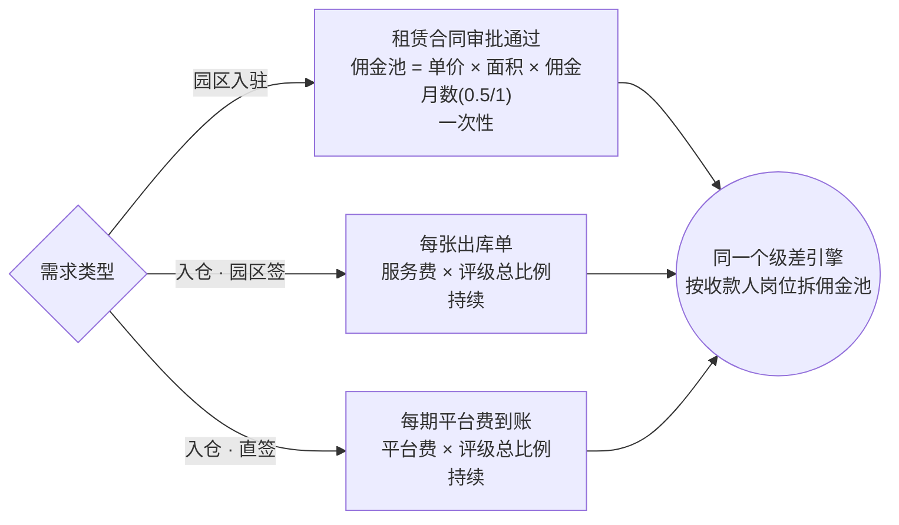

租赁算例：A 级租客，300 元/㎡/月 × 100 ㎡ = 月租 30,000，佣金月数 1 → 佣金池 30,000；4 级链：园区伙伴（成交人，50%）15,000 · 银牌（20% 级差）6,000 · 金牌（15%）4,500 · 钻石（15%）4,500，合计 30,000。首期租金到账后解冻，一次结清。

`crm_referral_order.source_type`：`1 租赁签约（一次性）` `2 出库单` `3 平台费收款` `4 签约奖（入仓合同·可选）` `5 增值服务收款（预留）`。租赁事件落 `base_amount = 月租金`、`total_rate` 字段改存 **佣金月数**（比例与月数统一用 `pool_factor` 表达：租赁 = 月数，入仓 = 百分比 / 100），`pool_amount = 佣金池`。

### 2.8 佣金流水状态机

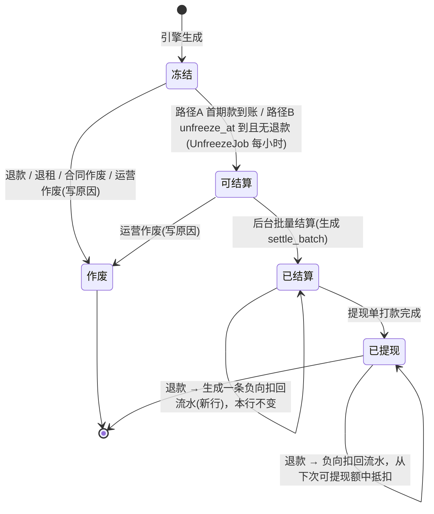

扣回规则：负向流水 `amount < 0`，`status=可结算`，在伙伴「可提现余额」里直接抵扣；余额为负时禁止提现，直到回正。

### 2.9 结算与提现

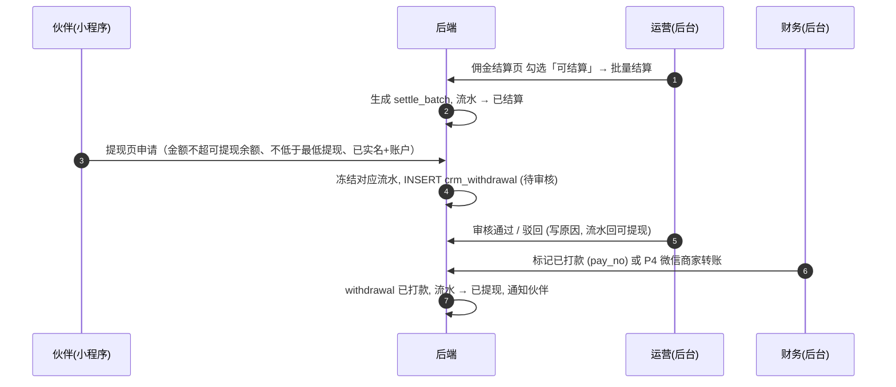

幂等：`pay_no` 唯一；「标记已打款」条件更新 `status=已审核 → 已打款`，重复点击返回原结果不重复出账（照 `PaymentService` 写法）。

**税务（v6 补，待拍板）**：伙伴多为个人，佣金属劳务报酬。两种模式（规则参数 `tax_mode`）：①**个税代扣**：财务按劳务报酬预扣率算税，提现单显示税前/税后/税额，打税后金额；②**灵活用工平台代征**（P4 接入）：园区付平台、平台代发代征。P1 先按①实现字段与算法，模式由负责人与财务定。**提现单加列** `tax_amount / net_amount / tax_mode`。

**伙伴状态对佣金的影响**：冻结 → 佣金照常生成、不能提现；退出/注销 → 其份额**园区留存**（不向上补给上级，避免"踢人得利"）；注销后手机号/openid 匿名化、财务记录保留。

### 2.10 云仓结算（园区 → 云仓）

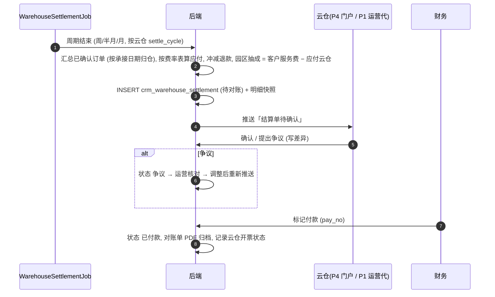

口径：结算周期按自然周/半月/月，切分点 00:00；云仓自有客户订单不进结算；退款按事件日期冲减当期。**方向**：园区签客户的订单 → 结算单 `direction=付`（园区付云仓）；直签客户的订单 → `direction=收`（云仓付园区平台费）；同一云仓同一周期两个方向各一张单，可合并净额付款。直签的平台费到账 → 触发对应佣金解冻。

### 2.11 岗位晋升 / 降级复核（每月 1 日）

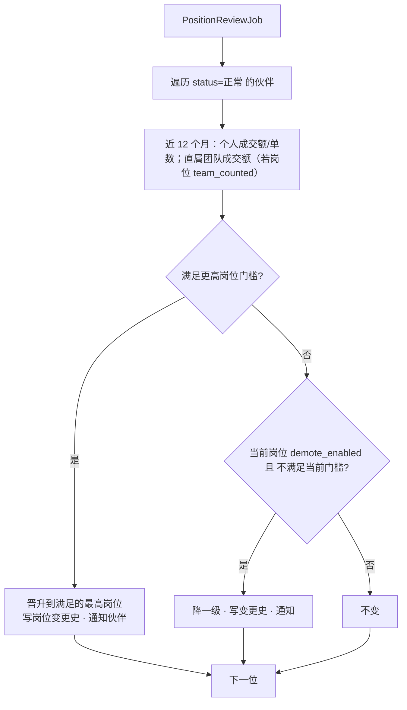

规则：门槛只含**成交额 / 单数**；**没有人数**；晋升立即生效，只影响之后的计佣；后台可手动调岗（写原因），手动调岗 90 天内不被自动降级。

### 2.12 钻石合伙人「团队分配」

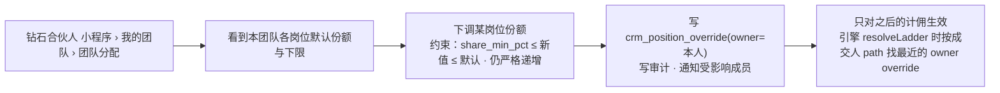

后台总开关 `marketing.override_enabled` 关闭时入口隐藏、已有 override 失效。

### 2.13 风控与反作弊（v6 补）

| 场景 | 措施 |
|---|---|
| 批量注册小号 | 一个 openid/unionid 一账号；手机号唯一；同设备/同 IP 日注册上限（规则参数）；提现前必须实名 |
| 虚假客户 | 推荐必须有真实手机号；专员跟进才进意向；只有合同生效 / 云仓真实出库才计佣 |
| 云仓刷单 | `shipped` 必带物流单号；对账差异 > 阈值冻结该云仓计佣；云仓自有客户订单不计佣 |
| 内部人员套利 | 手机号命中 `sys_user` 标记内部人员，默认不计佣 |
| 份额倒挂 | 份额严格递增校验；override 只能下调不能上调 |
| 月度异常 | 可选 `monthly_cap`：单伙伴月佣金上限，超出进人工复核 |
| 抢客 | 归因记录页可查判定依据；拒绝时不暴露已有推荐人 |

---

## 3. 规则与口径（可配置项全表）

| 参数 | 默认 | 范围 / 说明 | 存放 |
|---|---|---|---|
| 岗位数 `ladder_depth` | 2 | 2 / 4；admin 可改，写审计，4 级常驻合规提示 | `biz_setting` |
| 岗位份额 | 2 级：60/100；4 级：50/70/85/100 | 严格递增、顶格 100 | `crm_position` |
| 合伙人可下调下限 | 40/60/80/— | ≤ 默认 | `crm_position.share_min_pct` |
| 合伙人自定份额开关 | 开 | 关则入口隐藏、override 失效 | `biz_setting` |
| 客户评级总比例（合同） | A 3.0 / B 2.0 / C 1.5 / D 1.0 % | 可按园区覆盖 | `crm_customer_grade` |
| 客户评级总比例（ERP） | A 8 / B 6 / C 5 / D 3 % | 同上 | 同上 |
| 评级自动建议门槛（租赁线） | 按月租金：A ≥ 8 万 / B ≥ 4 万 / C ≥ 1.5 万 / D 其余 | 专员可改，写依据 | `auto_min_rent` |
| 冻结天数 | 租赁：直到首期租金到账；平台费 / 签约奖：到账即可结算；出库单：7 天 | 出库单可 0–30 | 规则参数 |
| 最低提现 | 100 元 | | 规则参数 |
| 提现频率 | 每月 1 次免手续费 | 手续费口径 P4 定 | 规则参数 |
| 单人日推荐上限 | 20 | | 规则参数 |
| 自我推荐 | 拒绝 | 手机号相同 | 固定 |
| 归因规则 | 先到先得 | 或 N 天保护期 | 规则参数 |
| 重复客户判定 | 手机号 | 可加信用代码 | 规则参数 |
| 终止扣回窗口 | 生效 90 天内终止扣回 | | 规则参数 |
| ERP 心跳超时 | 6 小时 | 文件方式：2 倍上传周期 | 规则参数 |
| 对账差异阈值 | 单数或金额差 > 2% → 冻结该云仓计佣 | | 规则参数 |
| 老渠道佣金互斥 | 开 | 同一合同两边只算一边 | 规则参数 |
| 计佣基数 | **租赁：佣金池 = 月租金 × 佣金月数，一次性**；入仓园区签 = 每张出库单的园区服务费 × 总比例；直签 = 每期平台费 × 总比例；入仓合同签约奖 = 按评级固定额（可选配） | 见 §2.7a | `crm_commission_rule.base_mode` |
| 租赁佣金月数 | A 1.0 / B 1.0 / C 0.5 / D 0.5 个月 | 0.25–2；按评级、可按园区覆盖 | `crm_customer_grade.lease_commission_months` |
| 租赁退租扣回窗口 / 续签比例 | 90 天 / 0 | 续签默认不再计 | `lease_clawback_days` `lease_renew_ratio` |
| 评级自动建议（ERP 线） | A ≥ 50,000 单/月 / B ≥ 10,000 / C ≥ 2,000 / D 其余（预计月出库单量） | 与租赁线分开 | `crm_customer_grade.auto_min_orders` |
| 内部人员计佣 | 关 | 手机号命中 sys_user | 规则参数 |
| 月度佣金上限 | 不限 | 可设金额，超出进复核 | 规则参数 |
| 税务模式 | 个税代扣 | 或 灵工平台代征（P4） | 规则参数 |
| 归因业务线 | 租赁 / 云仓 分开 | | 固定 |
| 默认签约方式 | 园区签 | 园区级可改；客户级覆盖 | `default_sign_mode` |
| 预锁 / 有效锁定 / 延期 | 7 天 / 180 天 / 1 次 +90 天 | | `prelock_days` `lock_days` `lock_extend_days` |
| 锁定数上限 | 50 / 100 / 200 / 500 | 按岗位 | `crm_position.lock_cap` |
| 释放冷却 | 30 天 | 原伙伴不可再锁 | 规则参数 |
| 退货扣回 | 基数=服务费不扣；基数=货值扣 | | 固定 |

---

## 4. 数据模型

### 4.1 ER 图

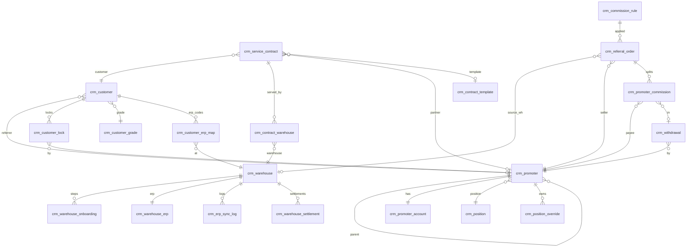

### 4.2 表清单（V41，全部带基座 7 列 + `project_id`）

| 表 | 关键字段 | 唯一键 / 索引 |
|---|---|---|
| `crm_promoter` | openid, unionid, phone, name, avatar, invite_code, parent_id, path, position_code(P1..P4), position_since, status(1正常 2冻结 3待审核 4已退出), is_internal, agreement_version, agreed_at, id_verified, bind_time, last_login, register_ip, device_id | UK openid · UK phone · UK invite_code · IDX parent_id · IDX path(前缀) |
| `crm_promoter_account` | promoter_id, real_name, id_no_enc, account_type(1微信 2银行卡 3支付宝), account_no_enc, bank_name, verified_at | UK promoter_id |
| `crm_position` | code(P1..P4), name, sort, share_pct, share_min_pct, lock_cap, promote_amount, promote_orders, team_counted, demote_enabled, status | UK code |
| `crm_position_override` | owner_promoter_id, position_code, share_pct | UK (owner_promoter_id, position_code) |
| `crm_position_history` | promoter_id, from_code, to_code, reason(自动/手动), operator, note | IDX promoter_id |
| `crm_customer_grade` | code(A-D), name, desc, lease_commission_months(租赁佣金月数), erp_total_rate(出库单/平台费), service_total_rate(增值服务·预留), contract_bonus(入仓合同签约奖), auto_min_rent(租赁线·月租金门槛), auto_min_orders(云仓线·月单量), sort, status | UK code |
| `crm_commission_rule` | name, source_type, project_id, category, base_mode, freeze_days, min_withdraw, grade_rate_override JSON, effective_from/to, status | IDX (source_type, project_id) |
| `crm_referral_order` | source_type(1租赁签约 2出库单 3平台费收款 4签约奖 5增值服务收款), pool_factor(租赁=佣金月数·入仓=总比例), pool_amount(佣金池), source_no, parent_order_no, source_id, warehouse_id, promoter_id, customer_id, customer_code, customer_grade, total_rate, base_mode, qty, service_fee(园区算), goods_amount(ERP 传·参考), status(1待确认 2已确认 3已退款 4已取消 5无归属), event_time, confirm_time, raw_payload JSON | UK source_no · IDX promoter_id · IDX (warehouse_id, event_time) |
| `crm_promoter_commission` | referral_order_id, promoter_id, position_code, share_pct, diff_pct, rule_id, base_amount, rate, amount, status(1冻结 2可结算 3已结算 4已提现 5作废), unfreeze_at, settle_batch_id, withdrawal_id, void_reason | UK (referral_order_id, promoter_id, sign) · IDX (promoter_id, status) |
| `crm_settle_batch` | batch_no, count, total_amount, operator | UK batch_no |
| `crm_withdrawal` | promoter_id, amount(税前), tax_mode, tax_amount, net_amount(税后实付), pay_no, status(1待审核 2已审核 3已打款 4已驳回), audit_by/at, pay_by/at, pay_method, reject_reason, commission_ids JSON | UK pay_no · IDX (promoter_id, status) |
| `crm_warehouse` | code, name, region, address, contact, phone, contact_openid(云仓小程序登录), platform_fee_model JSON(直签平台费：按单/按比例), area_sqm, daily_capacity, categories, join_status(1-7), erp_status(0-3), rating, settle_cycle, fee_model JSON, contract_file | UK code · IDX (join_status, erp_status) |
| `crm_warehouse_onboarding` | warehouse_id, step(1-5), status(待处理/进行中/通过/驳回), owner_id, deadline, done_time, reject_reason, attachments JSON | UK (warehouse_id, step) |
| `crm_warehouse_erp` | warehouse_id, mode(1webhook 2拉取 3文件), app_id, secret_enc, callback_url, pull_endpoint, pull_cron, field_mapping JSON, test_passed(0-3), last_sync_at, heartbeat_at, fail_count, status, accepted_by, accepted_at | UK warehouse_id · UK app_id |
| `crm_erp_sync_log` | warehouse_id, direction(in/out), event, order_no, http_status, ok, error, payload_digest | IDX (warehouse_id, created_at) |
| `crm_customer_lock` | customer_id, promoter_id, status(1预锁 2有效锁定 3已成交 4已释放), prelock_until, lock_until, confirmed_by/at, extended_count, extend_reason, released_reason, released_by/at | UK (customer_id, status IN 1/2 via active_unique_key 技巧) · IDX (promoter_id, status) |
| `crm_contract_warehouse` | contract_id, warehouse_id, is_primary, effective_from, effective_to | UK (contract_id, warehouse_id, effective_from)；一合同可多仓、可换仓 |
| `crm_customer_erp_map` | customer_id, warehouse_id, customer_code(货主在云仓 ERP 的编码), status | UK (warehouse_id, customer_code) · UK (customer_id, warehouse_id) |
| `crm_service_contract` | contract_no, sign_mode(1园区签 2云仓直签), customer_id, warehouse_id(主仓·冗余), partner_id, grade, service_type(1仓储 2代发 3仓配), fee_model(1仓租 2单票 3按件 4包月), price_table JSON, deposit, start_date, end_date, auto_renew, pay_cycle, status(1-8), sign_method, signed_at, version, template_id, files JSON, terminate_reason | UK contract_no · IDX customer_id · IDX warehouse_id · IDX (status, end_date) |
| `crm_service_contract_version` | contract_id, version, snapshot JSON, changed_by, change_note | UK (contract_id, version) |
| `crm_contract_template` | name, service_type, version, body, variables JSON, status | UK (name, version) |
| `crm_warehouse_settlement` | settle_no, warehouse_id, direction(1园区付云仓 2云仓付园区), period_start, period_end, order_count, goods_amount, customer_fee(客户服务费), refund_deduct, payable(应付云仓), park_share, status(1待对账 2已确认 3已付款 4争议), pay_no, confirmed_at, paid_at, invoice_status, dispute_note, statement_file | UK settle_no · UK (warehouse_id, period_start) |
| **老表加列** | `crm_lead` + referrer_id, referral_code · `crm_customer` + grade, referrer_id, service_type, attribution_note, biz_line(租赁/云仓), sign_mode · `biz_contract` + grade · `crm_customer.phone` 加唯一约束（带 deleted） | 承接云仓不再挂在客户上，从合同 → `crm_contract_warehouse` 推导 |
| **菜单/权限** | `sys_menu` 目录「全民营销」(parent=20) + 19 个菜单 + 权限点 `crm:marketing:*`；`sys_role_menu` 挂 admin；`route_module_mapping` 加 `/crm/marketing/**` | 照 V30/V36 幂等模板 |

共 **22 张新表**（v7 加 `crm_customer_lock`）。迁移拆两份：**V41** = P1 用到的表（伙伴/岗位/评级/客户/合同/云仓/加盟/佣金/提现），**V42** = P2 的（ERP 对接/同步日志/订单映射/结算），减少一次上线的爆炸半径；apply 前 `ops dump` 备份（§3.7：新宿主无回滚）。

---

## 5. 接口清单

### 5.1 后台 `/api/crm/marketing/**`（RBAC，`@PreAuthorize("hasAuthority('crm:marketing:<页>:<op>')")`）

| 资源 | 端点 | op |
|---|---|---|
| dashboard | GET /dashboard/summary?range · /funnel · /trend · /top · /alerts | query |
| promoter | GET /promoter/page · GET /{id} · GET /{id}/team · /{id}/customers · /{id}/orders · /{id}/commissions · /{id}/withdrawals · /{id}/history | query |
| | POST /{id}/audit {pass,reason} · /{id}/position {code,reason} · /{id}/parent {parentId,reason} · /{id}/freeze · /{id}/unfreeze · /{id}/reset-invite | edit / audit |
| position | GET /position/list · PUT /position · PUT /position/depth {2\|4} · POST /position/review-now · GET /position/review-log | config |
| grade | GET /grade/list · PUT /grade | config |
| customer | GET /customer/page · GET /{id} · POST /{id}/grade {grade,reason} · /{id}/assign-staff · /{id}/assign-warehouse · /{id}/lose {reason} · /merge | edit |
| contract | GET /contract/page · GET /{id} · POST /contract · PUT /{id} · POST /{id}/submit · /{id}/audit · /{id}/sign-offline(上传) · /{id}/esign(P4) · /{id}/effect · /{id}/amend · /{id}/terminate · /{id}/void · /{id}/renew · GET /{id}/pdf · GET /{id}/versions | edit / audit |
| contract-template | CRUD · POST /{id}/enable | config |
| warehouse | GET /warehouse/page · GET /{id} · POST · PUT · POST /{id}/pause · /{id}/resume · /{id}/exit · GET /{id}/customers · /{id}/orders · /{id}/settlements | edit |
| onboarding | GET /onboarding/page · GET /warehouse/{id}/steps · POST /warehouse/{id}/step/{n}/pass · /reject · /upload | audit |
| erp | GET /erp/page · GET /warehouse/{id}/erp · POST /issue(签发凭证) · /reset-secret · /test-orders(发 3 张) · GET /test-results · POST /accept(验收) · GET /sync-logs · POST /retry-failed · PUT /mapping | config / audit |
| wh-settlement | GET /page · POST /generate {warehouseId, period} · POST /{id}/push · /{id}/confirm(代确认) · /{id}/dispute · /{id}/pay {payNo} · GET /{id}/statement | edit / pay |
| order | GET /order/page · GET /{id} · POST /manual · /{id}/void · /{id}/recalc · GET /{id}/raw | edit |
| reconcile | GET /reconcile/page · POST /reconcile/run {warehouseId, period} · GET /{id}/diff · POST /{id}/resolve | edit |
| commission | GET /commission/page · POST /settle {ids[]} · /{id}/void {reason} · GET /batches | edit / pay |
| withdrawal | GET /withdrawal/page · POST /{id}/approve · /{id}/reject · /{id}/pay {payNo} · GET /export | audit / pay |
| rule / setting / msg-template / log | CRUD / GET | config |

统一：分页 `page,size,sort`；导出 `GET …/export` 返回 xlsx（POI）；所有写接口写 `sys_audit(module='crm.marketing')`。

### 5.2 小程序 `/api/mp/v1/**`（`MpJwtAuthFilter`，subject = promoter_id）

| 端点 | 说明 |
|---|---|
| POST /auth/wx-login · /auth/bind-phone · /auth/bind-invite | 登录、手机号授权注册、补填邀请码 |
| GET /me · PUT /me · POST /me/verify(实名) · PUT /me/account(收款账户) | 资料 |
| GET /home | 累计 / 可提现 / 冻结 / 本月 + 最近动态 |
| POST /referral · GET /referral/page · GET /referral/{id} | 推荐客户（= 报备，预锁）、我的客户（状态/评级/承接云仓/**锁定状态与剩余天数**，不返回金额） |
| POST /referral/{id}/extend | 申请延期锁定（运营审核） |
| GET /warehouses?online=1 | 意向云仓下拉（只列已上线且已联通） |
| GET /position · GET /position/progress | 我的岗位、晋升进度 |
| GET /team · GET /team/allocation · PUT /team/allocation(仅顶格岗位) | 团队（直属一层）、团队分配 |
| GET /commission/page?status · GET /commission/{id} | 收益明细（含 评级 × 份额/级差 = 比例） |
| GET /withdrawal/balance · POST /withdrawal · GET /withdrawal/page | 提现 |
| GET /poster | 邀请海报（小程序码 + 邀请码） |
| GET /notice/page | 消息 |

安全：手机号/身份证/账户只回脱敏；所有金额只回本人的；团队接口不返回隔级；`GET /referral/{id}` 若客户被判定已存在于他人名下返回 403。

### 5.3 开放接口 `/api/open/v1/erp/**`（permitAll 白名单 + 自定义验签）

```
POST /api/open/v1/erp/order-event
Headers:
  X-App-Id:     wh_xxx（crm_warehouse_erp.app_id）
  X-Timestamp:  Unix 秒，与服务器时间差 ≤ 300s
  X-Nonce:      随机串，5 分钟内不得重复（Redis 存）
  X-Signature:  HMAC-SHA256(secret, X-Timestamp + "\n" + X-Nonce + "\n" + body)  hex
Body:
{
  "event": "order.created | order.shipped | order.returned | order.refunded | order.cancelled",
  "order_no": "OUT20260918000123",                         // 出库单号，云仓内唯一
  "parent_order_no": null,                                // 拆单时填父单号
  "occurred_at": "2026-09-18T10:20:00+08:00",
  "warehouse_code": "WH-HZ-001",                          // 必须与 App-Id 对应的云仓一致
  "customer_code": "HZ-C0021",                            // 货主（我们的客户）在云仓 ERP 的编码 —— 归属只认它
  "qty": 3,                                               // 件数
  "packages": 1,                                          // 包裹数（单票费按此）
  "fee": { "storage": 0, "handling": 4.5, "express": 8.2 },   // 云仓报的费用（参考，园区按合同单价表自算）
  "goods_amount": 1180.00,                                // 货值（可选，仅 base_mode=货值 时用）
  "logistics": { "carrier": "SF", "tracking_no": "SF123456789" },   // shipped 必填
  "items": [ { "sku": "P001", "name": "...", "category": "home", "qty": 3 } ]
}
Response: 200 {"ok":true,"order_id":123,"attributed":true|false}   // attributed=false 表示 customer_code 未映射（云仓自有客户）
          400 {"ok":false,"code":"SIGN_INVALID|APP_DISABLED|BAD_PAYLOAD|WH_MISMATCH|NONCE_REPLAY","msg":"..."}
```

```
GET  /api/open/v1/erp/ping                        心跳（可选；有事件即视为心跳）
POST /api/open/v1/erp/orders/batch                批量事件（≤ 500 条，逐条返回结果）
GET  /api/open/v1/erp/contract                    返回本云仓当前契约版本与字段映射（自助排错）
```

拉取方式（mode=2）：`ErpPullJob` 按 `pull_cron` 调 `pull_endpoint`，云仓返回同结构数组；字段名不同用 `field_mapping` JSONPath 映射。文件方式（mode=3）：后台「ERP 对接 › 上传文件」按模板导入，走同一 `Ingest`——**P1 就实现文件方式**，让路径 B 在没有真实 ERP 时也能跑通并验收。对账：优先 `GET pull_endpoint?summary=period`；没有查询接口的云仓按月上传对账单文件。可选：每云仓 IP 白名单。

### 5.3a 云仓小程序 `/api/wh/v1/**`（v7，`WhJwtAuthFilter`，subject = warehouse_id，登录按 `contact_openid` / 手机号识别身份）

| 端点 | 说明 |
|---|---|
| POST /auth/wx-login · /auth/bind-phone | 与伙伴端共用登录，按手机号命中 `crm_warehouse.phone` 进入云仓身份（同一手机号两种身份则弹选择） |
| POST /apply · PUT /apply · POST /apply/attachments | 加盟申请、资质上传 |
| GET /onboarding | 加盟进度：5 步、每步状态/负责人/时限/驳回原因 |
| GET /erp · POST /erp/issue-sandbox · POST /erp/test-orders · GET /erp/test-results · GET /erp/sync-logs | ERP 自助：拿沙箱凭证、发测试单、看回执/日志/心跳（正式凭证由运营在验收后签发） |
| GET /agreement · POST /agreement/upload | 加盟协议查看 / 线下签署件上传（P4 电子签） |
| GET /dashboard | 上线后：承接客户数、今日/本月出库单、断连/失败告警 |
| GET /customers · GET /orders/page | 承接客户与出库单（只看本仓） |
| GET /settlement/page · POST /settlement/{id}/confirm · /dispute | 结算单确认 / 争议（两方向都在） |
| POST /contracts（直签） · GET /contracts | 直签模式：录入并上传客户合同，等园区审核 |
| GET /notice/page | 消息 |

### 5.4 领域事件（`common/event/DomainEvent`，新增）

| 事件 | 发布者 | 订阅者 |
|---|---|---|
| `promoter.registered` | MpAuth | 通知 |
| `referral.created` | Referral | 通知专员 |
| `service_contract.effective` | ServiceContractService | CommissionEngine（路径 A）、园区签生成 fin_bill / 直签生成平台费应收、通知云仓 |
| `customer.locked / lock.expiring / lock.released` | LockService / LockExpireJob | 通知伙伴与专员 |
| `warehouse.applied / step.changed` | OnboardingService | 通知云仓（小程序）与运营 |
| `payment.received`（已有） | PaymentService | CommissionEngine：租赁合同首期租金到账 → 解冻该合同的一次性佣金；入仓合同 → 解冻签约奖；直签平台费到账 → 解冻 |
| `contract.approved`（已有，租赁） | ContractService | **生成租赁一次性佣金**（佣金池 = rent_price × rent_area × 佣金月数，冻结）；与老渠道佣金互斥 |
| `erp.order.shipped / refunded / cancelled` | Ingest | CommissionEngine |
| `commission.unfrozen / settled / paid` | Engine / Settlement / Withdrawal | 通知伙伴 |
| `warehouse.erp.disconnected / reconnected` | HeartbeatJob | 告警、禁止分配 |
| `position.changed` | PositionReviewJob / 后台 | 通知伙伴 |

### 5.5 定时任务

| Job | 频率 | 做什么 |
|---|---|---|
| `UnfreezeJob` | 每小时 | 路径 B：`unfreeze_at ≤ now` 且订单未退款 → 可结算 |
| `ErpHeartbeatJob` | 每 10 分钟 | 心跳超时 → 断连告警；恢复 → 已联通 |
| `ErpPullJob` | 按各仓 cron | mode=2 拉取 |
| `ErpRetryJob` | 每 5 分钟 | 失败事件重试（指数退避，最多 10 次，进死信） |
| `PositionReviewJob` | 每月 1 日 02:00 | 晋升/降级复核 |
| `WarehouseSettlementJob` | 每日 01:00 | 周期到期的云仓生成结算单 |
| `ContractReminderJob` | 每日 09:00 | 到期 30/7 天、待签超 7 天、应收逾期 |
| `ReconcileJob` | 每日 03:00 | 拉 ERP 汇总与本地比对，差异 > 阈值冻结计佣并告警 |
| `LockExpireJob` | 每日 02:00 | 预锁 7 天未确认 → 释放；有效锁定到期 → 释放进公海；到期前 15 天提醒 |
| `ServiceFeeBillJob` | 每月 1 日 | 按客户合同单价表 × 当月出库单汇总生成客户服务费账单 `fin_bill`（客户 → 园区那条钱） |

---

## 6. 页面清单与流转

### 6.1 后台（6 组 19 页）页面流转

```mermaid
flowchart LR
  DB[看板] -->|点指标下钻| PR[伙伴管理] & CU[客户管理] & WH[云仓管理] & CM[佣金结算] & WD[提现审核] & CT[合同管理]
  PR --> PRD["伙伴详情<br/>资料·团队·客户·订单·佣金·提现·岗位史·日志"]
  CU --> CUD["客户详情<br/>资料·归因·跟进·合同·订单·佣金·日志"]
  CUD -->|新建合同| CT
  CT --> CTD["合同详情<br/>条款·单价表·版本·签署·账单·计佣·附件·日志"]
  WH --> WHD["云仓详情<br/>资料·资质·协议·ERP·客户·订单·结算·评价·日志"]
  WH --> OB[加盟申请]
  WHD --> ERP[ERP 对接]
  WHD --> WS[云仓结算]
  CM --> OR[计佣订单] --> RC[ERP 对账]
  CM --> WD
  SET["设置：规则参数·佣金规则·消息模板·操作日志"] -.-> DB
  POS[岗位与份额] & GR[客户评级与总比例] -.-> CM
```

逐页的列表字段 / 筛选 / 操作 / 详情页签见姊妹文档 §5.5（19 页逐条，本文不重复）。

### 6.2 小程序页面流转

```mermaid
flowchart LR
  L[启动/登录] -->|首次| B[手机号授权 + 邀请码]
  L --> H[首页：累计/可提现/冻结/本月 · 最近动态]
  H --> R[推荐客户：仓储代发 / 园区入驻]
  H --> C[我的客户：状态·评级·承接云仓·锁定剩余天数]
  H --> P[我的岗位：份额·晋升进度]
  P --> T[我的团队：直属一层]
  T -->|钻石合伙人| TA[团队分配]
  H --> I[收益明细：冻结/可提现/已提现/扣回]
  I --> W[提现：申请·记录]
  H --> ME[我的：实名·收款账户·消息]
  H --> PO[邀请海报]
```

### 6.2a 云仓小程序页面流转（v7）

```mermaid
flowchart LR
  L[登录 · 按手机号识别云仓身份] --> A[加盟申请：资料 · 资质附件]
  A --> S[加盟进度：5 步时间线]
  S --> E[ERP 自助：沙箱凭证 · 发测试单 · 回执 · 同步日志 · 心跳]
  E --> G[加盟协议：查看 · 上传签署件]
  G --> D[运营看板：承接客户 · 出库单 · 告警]
  D --> O[承接客户 / 出库单]
  D --> ST[结算单：确认 · 争议]
  D --> CT[直签合同上传 · 备案状态]
```

### 6.3 看板指标口径（v6 补）

| 指标 | 口径 |
|---|---|
| 出库单量 | `crm_referral_order` status=已确认 的条数（按 event_time） |
| 服务费收入 | 园区按合同单价表算出的 `service_fee` 合计（不是 ERP 传的 fee，不是货值） |
| 应付云仓 | 结算单 payable 合计 |
| 佣金支出 | 佣金流水 amount 合计（含负向扣回） |
| 园区毛利 | 服务费收入 − 应付云仓 − 佣金支出 |
| 活跃伙伴 | 近 30 天有推荐或有佣金入账的伙伴 |
| 漏斗 | 推荐 → 已到访 → 签约（合同生效）→ 履约（有出库单） |

### 6.4 权限矩阵（角色 × 页面 op）

| 页 | 招商专员 | 运营 | 财务 | 管理员 |
|---|---|---|---|---|
| 看板 | query | query | query | query |
| 伙伴管理 | query | query/edit/audit | query | 全部 |
| 岗位与份额 / 客户评级 | query | query | — | config |
| 客户管理 | query/edit | query/edit | — | 全部 |
| 合同管理 | query/edit | query/audit | query | 全部 |
| 合同模板 | query | query | — | config |
| 云仓管理 / 加盟申请 | query | query/edit/audit | query | 全部 |
| ERP 对接 | — | query/config/audit | — | 全部 |
| 云仓结算 | — | query/edit | query/pay | 全部 |
| 计佣订单 / ERP 对账 | query | query/edit | query | 全部 |
| 佣金结算 | query | query/edit | query/pay | 全部 |
| 提现审核 | — | query/audit | query/pay | 全部 |
| 规则参数 / 佣金规则 / 消息模板 | — | query | — | config |
| 操作日志 | — | query | query | query |

---

## 7. 非功能要求

| 项 | 要求 |
|---|---|
| 幂等 | ERP 事件 `(source_no,event)`；结算批次；提现 `pay_no`；云仓结算 `pay_no`；佣金生成 `UK(order_id, promoter_id, sign)` |
| 并发 | 状态迁移全部「条件更新」（`WHERE status = 旧值`），受影响行数 = 0 视为冲突返回 409；`@Version` 乐观锁 |
| 事务 | 合同生效 = 状态 + 事件 + 账单 一个事务；引擎拆分 = 一个事务；改上级 = 子树 path 一个事务 |
| 加密 | 身份证、收款账号、ERP secret 用现有 AES-GCM（`ZHYQ_FIELD_ENCRYPTION_KEY`）；日志与接口永不回显 |
| 审计 | 所有写操作 `sys_audit`；岗位数切换、份额修改、总比例修改、改上级、调岗、作废、打款 额外推 Bark |
| 脱敏 | 手机号 138****0000；小程序不回他人任何金额 |
| 限流 | `/open/v1/erp/**` 每 app_id 600 次/分钟；`/mp/v1/referral` 每人 20 次/日；nonce 防重放存 Redis（TTL 5 分钟） |
| 告警 | ERP 断连、对账差异、失败重试进死信、提现超 3 天未审、冻结期满 24h 未结算 |
| 时区/精度 | 金额 DECIMAL(14,2) HALF_UP；比例 DECIMAL(6,2)；时间 DATETIME 东八区 |
| 多园区 | 所有新表 `project_id`；后台按当前园区过滤；伙伴、云仓可跨园区（`project_id` 可空 = 全部） |
| 前端共享文件 | `router/index.js`、`layout/menu.js` 为主脑独占文件（CLAUDE.md），新增路由与菜单集中一次改，不散改 |
| 个人信息 | 注册时勾选伙伴协议 + 隐私协议（记版本与时间）；提供注销：匿名化 phone/openid，财务记录保留 |
| 性能 | 伙伴 10 万级、订单日 10 万级：`path` 前缀索引、`(promoter_id,status)` 索引、看板走每日聚合表（复用 `stats/DailyAggregationJob` 模式） |
| 测试 | 引擎单测覆盖：2/4 级、压缩、override、扣回、乱序事件、幂等；合同/云仓状态机每条迁移一个 case；开放接口验签用例（错签/过期/重放） |

---

## 8. 分期、交付定义（DoD）与验收

| Phase | 交付 | DoD（每条要有证据） | 估时 |
|---|---|---|---|
| **P1 后台基础** | V41（P1 表）+ 菜单权限；伙伴/岗位/评级/客户（含签约方式、锁定页签）/合同/合同模板/云仓管理/加盟申请 8 页；锁客状态机 + 到期 Job；引擎（路径 A 两种签约方式 + **路径 B 文件导入方式**）；解冻/晋升复核/合同提醒 Job；佣金结算/提现（线下，含税前税后）；规则参数/消息模板/日志；伙伴协议与隐私协议勾选 | Flyway 干净库跑通；引擎单测 ≥ 20 case 绿；真浏览器走完「录伙伴 → 录客户 → 评级 → 分配云仓（人工标记 ERP 已联通）→ 起草合同 → 审核 → 上传签署 → 生效 → 佣金冻结 → 录首付款 → 解冻 → 批量结算 → 提现审核 → 标记打款」全链路，截图留档；`@PreAuthorize` 全覆盖 | 7–9 天 |
| **P2 ERP 打通与订单** | V42（P2 表）；开放接口 + 验签 + 限流 + nonce；webhook/拉取两适配器（文件已在 P1）；货主编码映射；沙箱/正式双凭证、测试单、验收四关；结算单双方向；心跳/断连/重试/死信；计佣订单/ERP 对账/云仓结算/ERP 对接 4 页；服务费账单 Job；换仓流程 | 用 Postman 集合模拟一家云仓走完四关；乱序/重放/错签用例通过；对账差异触发冻结；云仓结算单生成→确认→付款 | 5–6 天 |
| **P3 小程序（伙伴端 + 云仓端）** | 一个 uni-app 工程两种身份；伙伴端 11 页（含锁定状态/延期）；云仓端 9 页（申请 / 进度 / ERP 自助 / 协议 / 看板 / 客户订单 / 结算确认 / 直签合同上传 / 消息）；订阅消息 | 真机：伙伴「扫码注册 → 报备 → 看锁定 → 收益 → 提现」；云仓「申请 → 看进度 → 自助拿沙箱凭证发测试单 → 上传协议 → 看板 → 确认结算单」；隔级不可见；金额只见本人 | 6–7 天 |
| **P4 自动化** | 电子签适配器（服务合同 / 加盟协议）；微信商家转账；灵工平台代征 | 电子签回调置生效；自动打款幂等；税务模式切换 | 3–4 天 |

每期结束：盲审（code-reviewer）→ 真浏览器/真机验收 → 承诺 vs 交付对账表 → 合并 → push `ver*` 分支自动部署（A 机 5 分钟 cron）。

---

## 9. 合规与风险（开发要落实的点）

| 风险 | 落实到代码/页面的动作 |
|---|---|
| 被认定传销 | 默认 `ladder_depth=2`；晋升门槛表**无人数字段**；无入门费入口；4 级切换页常驻红字 + 审计；一笔成交收款人数 ≤ 岗位数 |
| 微信审核 | 小程序文案：推荐有礼 / 推荐客户 / 园区伙伴；不出现分销/下线/团队佣金；类目「企业管理」 |
| 刷单 | 冻结期 + 退款扣回 + shipped 必带物流单号 + 对账差异冻结 + 日推荐上限 + 自我推荐拒绝 |
| 个人信息 | 最小授权、加密、脱敏、隐私协议弹窗、注销入口 |
| 抢客纠纷 | 归因记录页可查判定依据；拒绝时不暴露已有推荐人 |
| 佣金税务 | 提现单税前/税后/税额三列；`tax_mode` 可切；伙伴协议写明税务口径 |
| 云仓合规 | 加盟协议 + 资质（营业执照、仓储/快递资质）附件必传；云仓自有客户订单不进园区账 |
| ERP 断连漏单 | 心跳告警 + 重试 + 对账 + 无归属订单人工归属 |
| 老租赁佣金重复 | 互斥开关默认开，引擎跳过写日志 |

---

## 10. v6 自审记录（思考不周之处与修正）

| # | 原来的问题 | 修正 | 落点 |
|---|---|---|---|
| 1 | 云仓订单按「买家实付金额」计佣——那是客户的消费者付给客户的钱，园区一分没收到 | 基数改为**园区服务费**（合同单价表 × 件数，园区自算），可选固定每单/货值 | §2.6 §3 |
| 2 | 订单靠 `buyer.phone / referral_code` 归属——出库单上的手机号是收件人，根本不是我们的客户 | 归属只认**货主编码** `customer_code` → `crm_customer_erp_map`；未映射 = 云仓自有客户，不计佣 | §2.6 §4.2 §5.3 |
| 3 | 服务合同路径 A 按「首年预计服务费」计佣——预计量可虚报 | 改为**按评级固定签约奖**，真实收益走路径 B | §3 |
| 4 | 客户只挂一个承接云仓——多地发货、换仓无法表达 | 合同 ↔ 云仓多对多 `crm_contract_warehouse`，含切换日期；换仓走合同变更 | §2.4 §4.2 |
| 5 | 「首期款」对纯后付的服务合同不存在 | 定义：保证金/首期账单/首月账单任一到账 | §2.4 |
| 6 | 没考虑退货 vs 退款 | 基数=服务费时退货不扣回（服务已发生），退款一律扣回 | §2.6 |
| 7 | 佣金付给个人没考虑税 | `tax_mode` 个税代扣 / 灵工平台，提现单税前税后，待拍板 | §2.9 §3 |
| 8 | 园区毛利可能为负（客户单价 < 云仓费率）没人拦 | 分配云仓时试算毛利，为负阻止 | §1.3 |
| 9 | 专员自己注册当伙伴、老租客的云仓线归因、同手机号并发推荐 | 内部人员不计佣；归因按业务线；Redis 锁 + 唯一约束 | §2.2 |
| 10 | 伙伴冻结/退出后佣金怎么走没定 | 冻结照算不能提；退出份额园区留存不上补 | §2.9 |
| 11 | 外部依赖（小程序主体、商户号、电子签、灵工、短信）没列，容易到期才发现卡在负责人手里 | §1.5 前置条件表 | §1.5 |
| 12 | 一次上线 19 张表、路径 B 到 P2 才能验 | 迁移拆 V41/V42；文件导入方式提前到 P1 让路径 B 可验 | §4.2 §8 |
| 13 | 看板「GMV」口径不清 | §6.3 指标口径表：服务费收入 / 应付云仓 / 佣金支出 / 毛利 | §6.3 |
| 14 | 客户 → 园区的服务费账单谁生成 | `ServiceFeeBillJob` 月度按单价表汇总生成 `fin_bill` | §5.5 |
| v7-1 | 只有「客户 ↔ 园区签」一种 | 加**云仓直签**：客户级 `sign_mode`，直签基数 = 平台费、解冻 = 平台费到账、结算单反向 | §1.3 §2.3a §2.10 |
| v7-2 | 归因只有先到先得，伙伴手上未成交的客户没有独占期 | **锁客两段式**：预锁 7 天 → 有效锁定 180 天，按岗位设上限，可延期一次，到期进公海 | §2.2a |
| v7.3 | 租赁佣金先按「首年租金 × 比例」再改「按月 12 期」，都不是市场做法 | **负责人拍板**：园区入驻按市场惯例**一次性收月租金 × 0.5 或 1 个月**作佣金池（单价 × 面积 → 月租金 → 佣金），与入仓发货完全两套；首期租金到账解冻，90 天退租扣回 | §2.7a §3 |
| v7-3 | 云仓只有 P4 的 Web 门户；加盟先签协议后打通 ERP | **云仓端小程序**（与伙伴端同一小程序）提前到 P3；加盟顺序改为 ERP 打通在签协议前，沙箱/正式双凭证 | §2.5 §5.3a §6.2a |

## 11. 附：小程序与后台界面稿

交互原型（小程序 6 屏、后台关键页、云仓/加盟/ERP/合同页、分佣演示）：Artifact《园区全民营销》https://claude.ai/artifact/YbhUoUhuoAZrESAofr33SJ

---

网页版（自带图表渲染，可下载本地打开）：[方案 + 界面稿合一页](/assets/marketing/2026-09-18-crm-marketing-prototype.html) · [开发方案文档版](/assets/marketing/2026-09-18-crm-marketing-dev-spec.html)　·　真相源：`zhyq-park/docs/superpowers/specs/2026-09-18-crm-marketing-dev-spec.md`（改文档改仓里的，再跑 build-park.py + rsync）

页面指纹：`2026-09-18-crm-marketing-dev-spec.html` sha256 `cdf867e65646ed9b`（页面改动即为新版本）